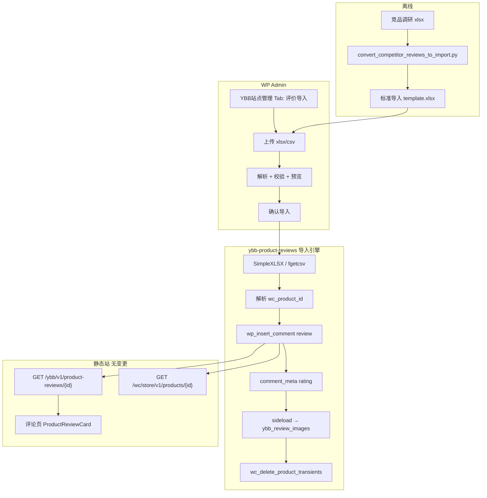

# 产品评价 Excel 批量导入 — 技术设计

> **方案代号：** PRI  
> **版本：** 1.0  
> **原则：** Woo 为评价真源；导入写 `wp_comments`；晒图走现有 `ybb_review_images`；前台只读 REST 不变。

---

## 1. 架构总览



---

## 2. 模块归属

| 模块 | 位置 | 理由 |
|------|------|------|
| 导入引擎 | `ybb-product-reviews/includes/review-import-engine.php` | 复用 `ybb_review_images`、auto-approve、transient 清理 |
| Admin UI | `ybb-product-reviews/includes/review-import-admin.php` | 表单、nonce、预览渲染 |
| XLSX 解析 | `ybb-product-reviews/includes/lib/SimpleXLSX.php` | 单文件嵌入，无 Composer |
| 模板资产 | `ybb-product-reviews/assets/product-reviews-import-template.xlsx` | 后台下载 |
| Site Manager Tab | `ybb-site-manager/includes/admin/page.php` **+ filter** | 统一运营入口，最小侵入 |

**不新建独立 mu-plugin 文件**：避免 `upload-mu-plugins.py` 清单膨胀与晒图逻辑重复。

---

## 3. Site Manager 集成（松耦合）

在 [`page.php`](../../deploy/wp-content/mu-plugins/ybb-site-manager/includes/admin/page.php) 增加扩展点：

```php
// $allowed 数组末尾由 filter 扩展
$allowed = apply_filters('ybb_sm_admin_allowed_tabs', [
    'navigation', 'announcements', /* ... */, 'audit',
]);

$labels = apply_filters('ybb_sm_admin_tab_labels', $labels);

// switch 内 default 分支前：
do_action('ybb_sm_admin_render_tab', $tab);
```

`ybb-product-reviews.php` 在 `plugins_loaded` 后：

```php
add_filter('ybb_sm_admin_allowed_tabs', function ($tabs) {
    $tabs[] = 'reviews-import';
    return $tabs;
});
add_filter('ybb_sm_admin_tab_labels', function ($labels) {
    $labels['reviews-import'] = '评价导入';
    return $labels;
});
add_action('ybb_sm_admin_render_tab', function ($tab) {
    if ($tab === 'reviews-import') {
        ybb_pr_render_import_admin_page();
    }
});
```

若 Site Manager 未加载，fallback：`add_submenu_page('woocommerce', ...)` 显示同等页面。

---

## 4. Excel / CSV 契约

### 4.1 Sheet / 文件

- **xlsx**：读取第一个 sheet，或名为 `reviews` 的 sheet（优先）
- **csv**：UTF-8 BOM，首行为表头

### 4.2 列定义（表头不区分大小写，`-` `_` 等价）

| 列名 | 必填 | 类型 | 说明 |
|------|------|------|------|
| `product_handle` | 三选一 | string | 站内 slug，如 `tz-hk-001` |
| `product_sku` | 三选一 | string | 父 SKU，如 `TZ-HK-001`（**非变体 SKU**） |
| `wc_product_id` | 三选一 | int | Woo 父商品 post ID，如 `50689` |
| `author` | 是 | string | `comment_author`，max 245 |
| `email` | 是 | string | `comment_author_email`，须含 `@` |
| `rating` | 是 | int | 1–5 → `rating` comment meta |
| `content` | 是 | string | `comment_content`，strip tags |
| `date` | 否 | date | `YYYY-MM-DD` 或 `YYYY-MM-DD HH:MM:SS` |
| `image_url_1` | 否 | url | 远程图，sideload |
| `image_url_2` | 否 | url | 同上 |
| `image_url_3` | 否 | url | 同上，**硬上限 3** |
| `status` | 否 | enum | `approved`（默认）/ `hold` |
| `source_note` | 否 | string | **解析后丢弃**，仅预览列展示 |

### 4.3 商品解析优先级

```
wc_product_id (若 >0 且 post_type=product)
  → product_sku (wc_get_product_id_by_sku，取 parent 若返回 variation)
  → product_handle (ybb_home_wc_find_product_by_handle 或 get_page_by_path)
```

变体 SKU 误入时：解析到 parent `product_id` 并 preview 提示「已映射到父商品」。

---

## 5. 导入引擎

### 5.1 核心函数

```php
/** @return array{rows: array, errors: array} */
function ybb_pr_import_parse_file(string $path, string $ext): array;

/** @return array{product_id: int, title: string}|WP_Error */
function ybb_pr_import_resolve_product(array $row): array|WP_Error;

/** @return 'skip'|'ok'|WP_Error */
function ybb_pr_import_row_exists(int $product_id, string $author, string $content): string;

/** @return array{comment_id: int, images_ok: int, images_failed: string[]}|WP_Error */
function ybb_pr_import_insert_row(array $row, int $product_id, bool $dry_run = false): array|WP_Error;

/** @return array{ok: int, skip: int, fail: int, details: array} */
function ybb_pr_import_batch(array $rows, bool $dry_run = false): array;
```

### 5.2 写入路径（与 Woo 一致）

```php
$comment_id = wp_insert_comment([
    'comment_post_ID'  => $product_id,
    'comment_author'   => sanitize_text_field($author),
    'comment_author_email' => sanitize_email($email),
    'comment_content'  => wp_kses_post($content),
    'comment_type'     => 'review',
    'comment_approved' => $status === 'hold' ? 0 : 1,
    'comment_date'     => $local_date,
    'comment_date_gmt' => get_gmt_from_date($local_date),
    'user_id'          => 0,
]);

update_comment_meta($comment_id, 'rating', max(1, min(5, (int) $rating)));
```

`pre_comment_approved` filter（已有）对 `hold` 行仍尊重 Excel 显式 `hold`。

### 5.3 晒图 sideload 与 Amazon 预览（v1.2 已实现）

**预览阶段** `ybb_pr_import_probe_image_url()`：

| 探测结果 | 预览行色 | 说明 |
|----------|----------|------|
| `ok_local` | 绿 | 站内媒体库 URL，优先 `attachment_url_to_postid` 复用附件 |
| `ok` | 绿 | 非 Amazon 远程 URL，`wp_remote_head` 可达 |
| `warn_amazon` | **黄** | Amazon 域名且 HEAD 成功，仍提示 sideload 可能失败 |
| `warn_amazon_blocked` | **黄** | Amazon 且 HEAD 失败 — 「请改站内 URL 重导」 |
| `warn_unreachable` | **黄** | 其他不可达 URL |

**导入阶段**：图片失败不阻断评论入库；`images_failed` 写入结果与预览警告。

**运营 SOP**：预览标黄 → 媒体库上传 → Excel 改 `image_url_*` 为 `https://carp-ybb.com/wp-content/uploads/...` → 重新预览导入（重复评论自动 skip）。

复用并抽取 [`ybb-product-reviews.php`](../../deploy/wp-content/mu-plugins/ybb-product-reviews.php) 现有逻辑：

1. `download_url($url, 30)` — 超时 30s
2. 校验 MIME / 2MB（`ybb_product_reviews_validate_image_file` 逻辑）
3. `media_handle_sideload` → attachment `post_parent = $product_id`
4. `update_comment_meta($comment_id, 'ybb_review_images', $attachment_ids)`

单条任一图失败：**评论仍入库**，预览/结果标记 `images_partial`；不整行回滚（避免重复点击产生双评论）。

### 5.4 去重策略

导入前查询：

```php
get_comments([
    'post_id' => $product_id,
    'type'    => 'review',
    'status'  => 'approve', // hold 不计入跳过？v1 仅 approve+hold 都比对
    'number'  => 0,
]);
```

匹配规则：`comment_author` 相同 **且** `substr(wp_strip_all_tags(comment_content), 0, 80)` 与待导入 content 前 80 字相同 → **skip**。

### 5.5 导入后

```php
wc_delete_product_transients($product_id);
// Woo 自动重算 _wc_average_rating / _wc_review_count
```

前台：

- `GET /ybb/v1/product-reviews/{wcId}` — 即时
- `GET /wc/store/v1/products/{wcId}` — `review_count` 即时
- **无需** `sync-from-wp` / `build-static`

---

## 6. Admin UI

### 6.1 页面状态机

```
[初始] → 上传文件 + 「预览」
[预览] → 表格（行级 status: ok / skip / error）+ 「确认导入 N 条」+ 「取消」
[完成] → 摘要 notice + 下载 log（可选）
```

### 6.2 安全

| 项 | 实现 |
|----|------|
| 权限 | `current_user_can('manage_options')` |
| CSRF | `wp_nonce_field('ybb_pr_import')` |
| 文件 | `wp_check_filetype` 仅 `xlsx`/`csv`；`$_FILES['import_file']['size']` ≤ 5MB |
| 行数 | 解析后 `count($rows) > 200` → 拒绝 |
| 输出 | 全程 `esc_html` / `esc_url` |

### 6.3 审计

若 `function_exists('ybb_sm_audit_append')`：

```php
ybb_sm_audit_append([
    'module' => 'reviews_import',
    'action' => 'import',
    'summary' => "导入评价：成功 {$ok}，跳过 {$skip}，失败 {$fail}",
    'meta' => ['file' => $filename, 'product_ids' => [...]],
]);
```

需在 `audit-log.php` 增加 module label `reviews_import` => `评价导入`。

---

## 7. 离线转换脚本

[`scripts/cross-border-ecom/convert_competitor_reviews_to_import.py`](../../../scripts/cross-border-ecom/convert_competitor_reviews_to_import.py)

| 源列 | 目标列 |
|------|--------|
| 评论者 | author |
| — | email = slugify(author)@review.import |
| 评分 | rating |
| 评论标题 + 评论正文 | content |
| 评论日期 | date（解析英文日期） |
| 评论图片URL / 所有图片URL | image_url_1~3 |
| — | product_handle=tz-hk-001, wc_product_id=50689 |
| 平台+ASIN | source_note |

---

## 8. 部署

| 变更 | 部署方式 | rebuild |
|------|----------|---------|
| `ybb-product-reviews.php` + includes + assets | `upload-mu-plugins.py` 扩展清单 **或** zip `ybb-product-reviews/` 目录 | 否 |
| `ybb-site-manager` page.php filter | `upload-ybb-site-manager.py` | 否 |

**版本号：** `ybb-product-reviews` → `1.2.0`；`ybb-site-manager` → patch bump（如 `1.8.6`）。

---

## 9. 验收

```bash
# REST
curl "https://carp-ybb.com/index.php?rest_route=/ybb/v1/product-reviews/50689"

# Store API review_count
curl "https://carp-ybb.com/index.php?rest_route=/wc/store/v1/products/50689"
```

人工：

- `/products/tz-hk-001/reviews` — 10 条、晒图可点开
- 重复导入 — skip=10, ok=0

---

## 10. 方案审查（合理性 / 准确性 / 最优性）

### 10.1 合理性 — 通过

| 判断 | 说明 |
|------|------|
| 数据流正确 | 评价真源在 Woo comments；与现有 REST/Store API 一致 |
| 无需 rebuild | 与 AGENTS 商品评价节一致 |
| 父商品 ID | TZ-HK-001 为 variable product，评价挂 `wcId=50689` 正确 |
| 预览两步 | 避免误导入；符合运营习惯 |

### 10.2 准确性 — 需注意的修正点

| 点 | 原方案 | 修正 |
|----|--------|------|
| mu-plugin 结构 | 仅单文件 `ybb-product-reviews.php` | v1.2 改为**目录包** `ybb-product-reviews/` + loader，或单文件 `require` 子目录（SiteGround 需一次上传整个目录） |
| `upload-mu-plugins.py` | 只列单 php | **必须更新**清单，包含 `includes/` 与 `assets/` |
| 变体 SKU | 未说明 | 解析到 variation 时自动提升为 `parent_id` |
| 图片失败 | 未定义 | 部分成功策略，避免半失败重试重复评论 |
| 竞品合规 | 仅提示 | `source_note` 不入库；建议运营改 `content` 列 |

### 10.3 最优性 — 方案对比

| 方案 | 评分 | 结论 |
|------|------|------|
| **A. 扩展 ybb-product-reviews + SM Tab（本方案）** | ★★★★★ | **推荐** — 复用晒图/批准逻辑，运营入口统一，无 rebuild |
| B. 独立 mu-plugin | ★★★ | 部署多文件，逻辑重复 |
| C. Python CLI 写 REST | ★★ | 需密钥、无预览 UI，不符合「后台入口」诉求 |
| D. 第三方 Woo 评价导入插件 | ★★ | 未知是否支持 `ybb_review_images`；额外依赖 |
| E. 仅 CSV 不支持 xlsx | ★★★ | 运营体验差；SimpleXLSX 成本低，应同时支持 |
| F. 公开 REST POST 批量 | ★ | 攻击面大，违反最小权限 |

### 10.4 残余风险与 v1.1 候选

| 项 | v1.0 | v1.1 |
|----|------|------|
| Amazon 图防盗链 | 手动换 URL / 先下载到媒体库再填站内 URL | 支持上传 zip 本地图包，按行号匹配 |
| 超 200 行 | 拒绝 | 异步队列 + Action Scheduler |
| 评价编辑/回滚 | 仅 Woo 原生删除 | 导入 log 含 comment_id，一键撤销批次 |
| AGENTS 文档 | M3 更新 | 补充「评价导入」Tab 路径 |

### 10.5 审查结论

**方案合理、技术路径准确，为当前约束下的最优解。**  
实施前必须同步：(1) mu-plugin 目录化部署清单；(2) Site Manager filter 扩展；(3) 三角钩首单用离线转换脚本生成模板再在后台导入。

---

## 11. 文件清单（实施后）

```
deploy/wp-content/mu-plugins/
├── ybb-product-reviews.php              # loader，version 1.2.0
└── ybb-product-reviews/
    ├── includes/
    │   ├── review-import-engine.php
    │   ├── review-import-admin.php
    │   └── lib/SimpleXLSX.php
    └── assets/
        └── product-reviews-import-template.xlsx

ybb-site-manager/includes/admin/page.php  # +3 处 filter/action
ybb-site-manager/includes/modules/audit-log.php  # +1 module label

scripts/cross-border-ecom/convert_competitor_reviews_to_import.py
reports/product-reviews-import/tz-hk-001-reviews-import-*.xlsx
```
